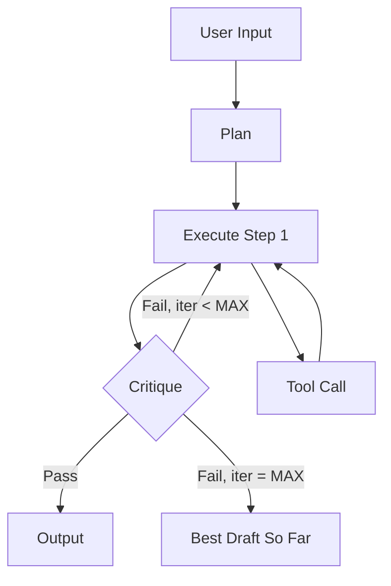

# Graph Engineering — Agent Workflow Design

> **Invoke this skill whenever you are designing any multi-step LLM or agent task.**
> The goal: replace fragile linear chains with resilient graphs where agents can reflect, branch, and self-correct.

---

## The Problem This Fixes

Most people who build a multi-step agent end up with a **straight line**:

```
prompt → step 1 → step 2 → step 3 → output
```

When step 1 emits imperfect output, everything downstream compounds the error — silently.

**Graph Engineering** turns that chain into a *network* where:
- Nodes can loop and self-correct (**reflection**)
- Agents can reach outside themselves for fresh data (**tool use**)
- Intent is made explicit before execution (**planning**)
- Responsibilities are split across specialists (**multi-agent**)
- Output quality is verified against a rubric before shipping (**critique**)

> Core insight from Andrew Ng's 4-agentic-patterns paper + codila's framing:
> **Loops let agents think. Graphs let agents remember.**

---

## The 5 Layers

Apply these in order. **Do NOT add all 5 by default** — each layer adds latency and cost. Add only what a real failure mode demands.

---

### Layer 1 — Reflection Loop

**What:** Agent generates → second prompt critiques its own output → agent revises.

**Add when:**
- First draft is almost-right but has a fixable, predictable flaw (wrong tone, missed edge case, minor hallucination)
- The task is creative or open-ended (writing, code architecture, explanation)

**Skip when:**
- The output is deterministically verifiable (unit tests, regex match, schema parse)
- You can check correctness with code — a reflection loop is pure overhead there

**ROI:** ~30% quality gain from a single self-critique pass. Cheapest layer to add.

**Prompt structure:**
```
SYSTEM: You are a critic. Here is a draft response: {draft}
Evaluate it against: {rubric}
Return: { issues: [...], severity: high|medium|low, revised_draft: "..." }
```

---

### Layer 2 — Tool Use

**What:** Agent decides which tool to call (search, code exec, MCP tool, DB query, RAG retrieval), calls it, reads the result back into its context.

**Add when:**
- The model cannot answer from parameters alone (needs current facts, computation, or external state)
- You are grounding responses in a knowledge base

**Design rules:**
- Define tools **narrowly** — `search_papers(query: str, year: int)` beats `do_research(anything: str)`
- Broad tools produce flaky routing. Narrow tools produce reliable calls.
- Always validate the tool's return before passing it back to the agent

---

### Layer 3 — Planning

**What:** Agent writes an explicit, inspectable plan *before* executing any step.

**Add when:**
- The task has ≥ 3 real sub-steps AND order matters
- Execution mistakes are expensive (API calls, writes, deploys)

**Skip when:**
- 1–2 steps: planning is pure overhead
- The task is exploratory and the plan can't be known upfront

**Bonus:** The plan is a debugging artifact — pause after the plan stage, validate it before spending tokens on execution.

**Format:**
```json
{
  "goal": "...",
  "steps": [
    { "id": 1, "action": "...", "depends_on": [], "tool": "..." },
    { "id": 2, "action": "...", "depends_on": [1], "tool": "..." }
  ]
}
```

---

### Layer 4 — Multi-Agent Coordination

**What:** Multiple specialized agents with distinct system prompts working in parallel or sequence (e.g. writer/critic, planner/executor, researcher/synthesizer).

**Add when:**
- One agent's system prompt is doing too many jobs and outputs are muddy
- Tasks are genuinely parallel and independent

**Hard rule:** Every agent must have **exactly one job**. N agents with overlapping responsibilities performs *worse* than 1 agent. Split by role, not by preference.

**Failure mode:** orchestrator agent doing routing + research + writing simultaneously — this is just a slow single agent with extra API calls.

---

### Layer 5 — Critique Loop *(highest ROI)*

**What:** A dedicated critique agent scores the output against an explicit rubric → feeds failures back for revision → loops until pass OR max-iteration cap is hit.

**Add when:**
- Quality matters more than latency
- You have a concrete, checkable definition of "good"

**Non-negotiable:** The rubric MUST be concrete — a checklist, JSON schema, or scored dimensions. "Is this good?" is not a rubric and produces either infinite loops or silent garbage acceptance.

**Loop structure:**
```
generate(draft) → critique(draft, rubric) → 
  if score >= threshold: return draft
  else if iterations < MAX: revise(draft, feedback) → loop
  else: return best_draft_so_far
```

**Always set MAX_ITERATIONS.** Never leave a loop unbounded in production.

---

## How to Apply This Skill

When a user describes a multi-step agent task:

1. **Diagnose the shape** — draw the current/proposed chain. Where does it silently fail?
2. **Pick 1–3 layers** — not all 5. Reflection + critique covers 80% of real cases.
3. **Sketch the graph** — produce a Mermaid diagram showing nodes, loops, and branches.
4. **Write the rubric** — bullet-point checklist or JSON schema. Concrete, not vibes.
5. **Set the failure budget** — max iterations before giving up. State it explicitly.
6. **Ship the smallest graph that works** — add layers only when a real failure mode demands them.

---

## Graph Sketch Template (Mermaid)



Adapt to your use case. Add nodes for each agent role. Show where loops close.

---

## Anti-Patterns

| Anti-Pattern | Why It Fails |
|---|---|
| All 5 layers on every task | Token cost ↑, latency ↑, debuggability ↓ — most tasks need 1–2 layers |
| Multi-agent when reflection would do | More agents = more context + more bugs. Prefer 1 agent + reflect |
| Critique loop without a rubric | Loops forever, or silently accepts garbage |
| Reflection without a focused critic prompt | "Make it better" adds noise. Critic must know WHAT to look for |
| Unbounded loops | Always cap MAX_ITERATIONS. Production agents must have an exit |
| Planning step then ignoring the plan | Plan is a contract. If the agent deviates, treat it as a bug |

---

## Output Format for This Skill

Always produce:

```
1. DIAGNOSIS — why the current design is fragile (1–2 sentences)
2. LAYERS CHOSEN — which of 5, and why NOT the others
3. GRAPH (Mermaid) — nodes, loops, branches
4. CRITIQUE RUBRIC — concrete checklist or schema
5. ITERATION CAP — the explicit max-loop integer
```

---

## Credits & Attribution

- **Skill author:** Bhavesh Khaple ([@BhaveshKhaple](https://github.com/BhaveshKhaple)) — Jul 26, 2026
- **Conceptual sources:**
  - Andrew Ng — *4 Agentic Design Patterns* (2024 PDF)
  - Andrej Karpathy — *Software 3.0 / Run LLMs in loops* framing
  - codila (@0xCodila) — *Loop Engineering* (Jul 1 2026) + *Graph Engineering* (Jul 21 2026)
- **Free to use, fork, and adapt.** If you build on this, a mention is appreciated but not required.
- **Part of:** [bhavesh-claude-skills](https://github.com/BhaveshKhaple/bhavesh-claude-skills) — Bhavesh's open collection of Claude/Runner skills.
